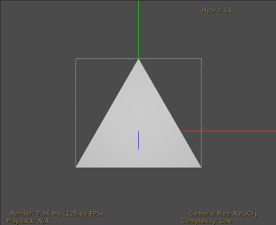

<a href="https://github.com/wetadigital/USDPluginExamples/actions?query=workflow%3A%22Build+and+test%22"></a>

# USDPluginExamples

A collection of example plugins for [Pixar's USD](https://github.com/PixarAnimationStudios/USD) (Universal Scene Description).

This project also aims to provide a set of CMake utilities for building USD plugins outside of the USD project source tree.  The utilities are heavily based on the build logic prescribed by the USD project itself. 

We hope the minimal examples and surrounding build infrastructure can be useful to USD community developers interested in building and deploying their own plugin(s).  

Huge thanks to Pixar's USD team for providing a highly extensible platform!

## Table of Contents

- [USD Plugins](#usd-plugins)
- [Dependencies](#dependencies)
- [Building](#building)
- [Running](#running)
- [CMake Utilities](#cmake-utilities)

## USD Plugins

**USDPluginExamples** provides the following USD plugins:
- [usdTri](./src/usdTri): A schema library defining a **Triangle** prim type.
- [usdTriImaging](./src/usdTriImaging): A prim adapter which images the **Triangle** prim type.
- [usdTriFileFormat](./src/usdTriFileFormat): A file format plugin which authors a triangular mesh for a `.triangle` payload.
- [hdTri](./src/hdTri): A hydra renderer plugin which images a triangle (in the most direct sense).
- [usdviewTri](./src/usdviewTri): An usdview plugin providing a menu command to define child Triangle prim(s) under selected paths.

There are many other USD plugins available online - check out [USD Working Group: Projects & Resources](https://wiki.aswf.io/display/WGUSD/USD+Projects+and+Resources) for more!

## Dependencies

The following dependencies are required:
- C++ compiler
- [CMake](https://cmake.org/documentation/) (Tested with CMake 3.29.2)
- [USD](https://github.com/pixaranimationstudios/USD) (24.05)
- [Boost](https://boost.org) and [Intel TBB](https://www.threadingbuildingblocks.org/) (USD dependencies)

[Python](https://www.python.org/) may also be required, depending on python support in the USD installation.

## Building

Example snippet for building the plugins on Linux (and potentially MacOS):
```bash
mkdir build
cd build
cmake \
  -DUSD_ROOT="/apps/usd/" \
  -DCMAKE_INSTALL_PREFIX="/apps/USDPluginExamples/" \
  ..
cmake --build  . -- VERBOSE=1 -j8 all test install
```

Example snippet for building a Visual Studio project on Windows (x64 Native Tools Command Prompt with Administrator privileges):
```cmd
mkdir build
cd build
cmake ^
    -G "Visual Studio 15 2017 Win64" ^
    -DUSD_ROOT="D:\install\usd" ^
    -DCMAKE_INSTALL_PREFIX="D:\install\USDPluginExamples\" ^
    ..

cmake --build . --config Release -j 8 --target ALL_BUILD RUN_TESTS INSTALL
```


CMake options for configuring this project:

| CMake Variable name     | Description                                                            | Default |
| ----------------------- | ---------------------------------------------------------------------- | ------- |
| `USD_ROOT`              | Root directory of USD installation                                     |         |
| `TBB_ROOT`              | Root directory of Intel TBB installation                               |         |
| `BOOST_ROOT`            | Root directory of Boost installation                                   |         |
| `ENABLE_PYTHON_SUPPORT` | Enable python support.  Must match python support of USD installation. | `ON`    |
| `BUILD_TESTING`         | Enable automated testing.                                              | `ON`    |

## Running

To register the plugin(s) as part of the USD runtime, the following environment variables will need
to be defined:
| Environment Variable  | Value(s)                                                                                 |
| --------------------- | ---------------------------------------------------------------------------------------- |
| `PYTHONPATH`          | `${USDPLUGINEXAMPLES_INSTALL_ROOT}/lib/python`                                           |
| `PXR_PLUGINPATH_NAME` | `${USDPLUGINEXAMPLES_INSTALL_ROOT}/lib/usd`<br/>`${USDPLUGINEXAMPLES_INSTALL_ROOT}/plugin/usd` |

Additionally, Windows requires:
| Environment Variable  | Value(s)                                                                                 |
| --------------------- | ---------------------------------------------------------------------------------------- |
| `PATH`                | `${USDPLUGINEXAMPLES_INSTALL_ROOT}/lib`                                                  |

Additionally, Linux requires:
| Environment Variable  | Value(s)                                                                                 |
| --------------------- | ---------------------------------------------------------------------------------------- |
| `LD_LIBRARY_PATH`     | `${USDPLUGINEXAMPLES_INSTALL_ROOT}/lib`                                                  |

<sub>Note: libraries and plugins are installed into different locations - thus PXR_PLUGINPATH_NAME specifies
two separate values.</sub>


Once the environment variables have been set-up, an example scene in this repo can be previewed with **usdview**:
```
usdview ./src/usdTri/scenes/triangle.usda
```

In the viewport, a triangle should be centered at origin:


## CMake Utilities

Custom CMake functions are provided, for abstracting away USD plugin build intricacies:
- `usd_library`: [Example usage](./src/usdTri/CMakeLists.txt)
- `usd_plugin`: [Example usage](./src/hdTri/CMakeLists.txt)
- `usd_executable`: [Example usage](./src/usdTri/CMakeLists.txt#L45)
- `usd_test`: [Example usage](./src/usdTri/tests/CMakeLists.txt#L5)
- `usd_python_library`: [Example usage](./src/usdviewTri/CMakeLists.txt)
- `usd_python_test`: [Example usage](./src/usdTri/tests/CMakeLists.txt#L1)

The interface of the above functions are largely based on those used throughout the [official USD project](https://github.com/PixarAnimationStudios/USD).

**USDPluginExamples** can be used as a template ("Use this template" button near the top of the page).

Another option to gain access to the cmake utilities is to copy/integrate the files under [cmake/](./cmake) into an existing project.
